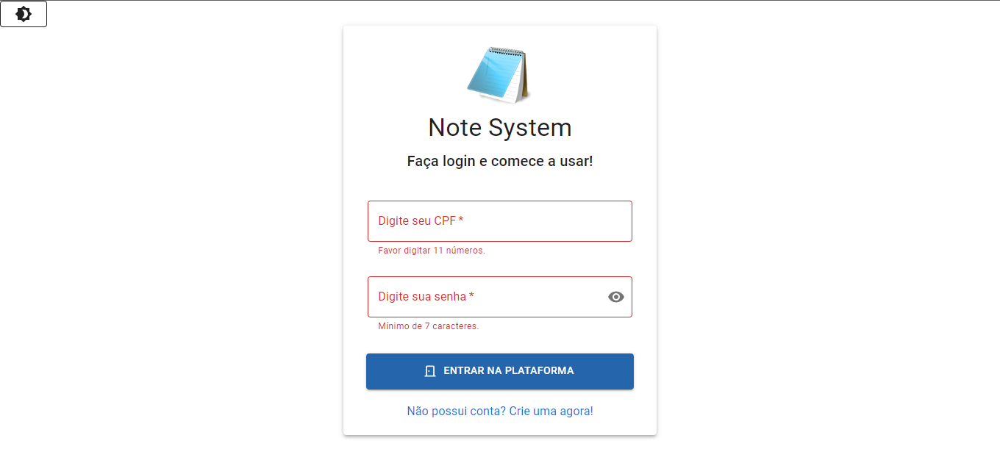
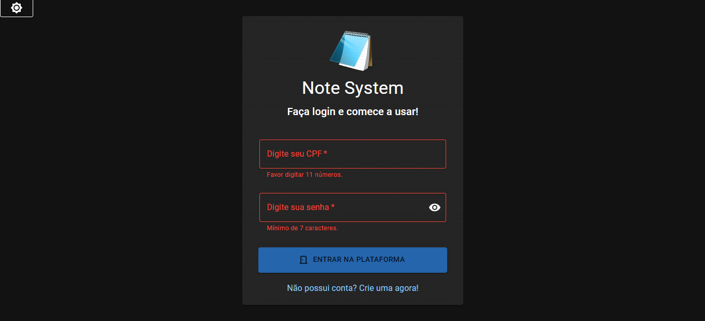
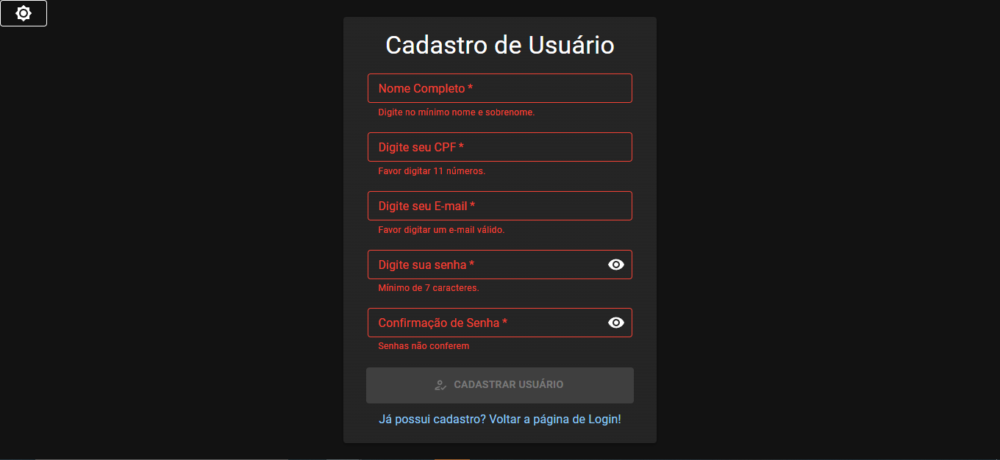
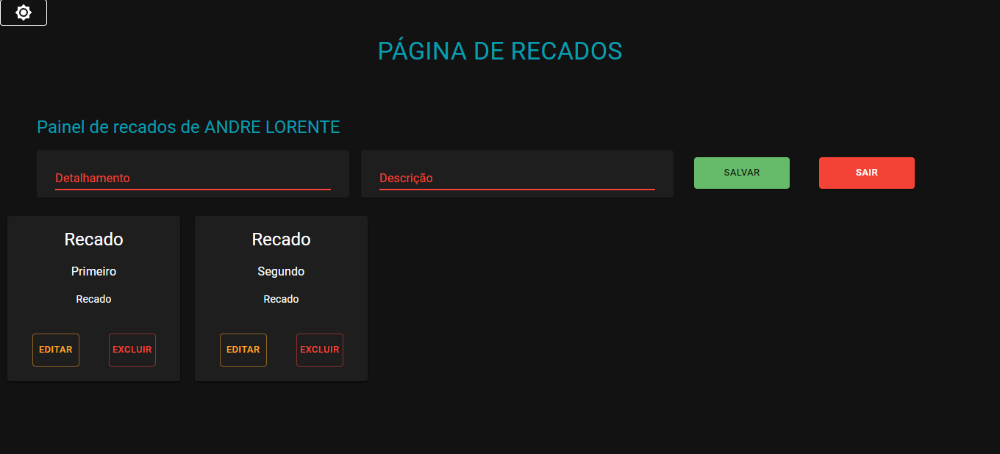

<h1 align="center"> Projeto Sistema de Recados </h1>

Projeto Final de Módulo - Growdev

  <a href="#-tecnologias">Tecnologias</a>&nbsp;&nbsp;&nbsp;|&nbsp;&nbsp;&nbsp;
  <a href="#-projeto">Projeto</a>&nbsp;&nbsp;&nbsp;|&nbsp;&nbsp;&nbsp;
  <a href="#-sistema">Sistema</a>&nbsp;&nbsp;&nbsp;|&nbsp;&nbsp;&nbsp;

 

  
  

  

  
  

  

  
  

  

<!-- 

  

  

 -->

## 🚀 Tecnologias

Esse projeto foi desenvolvido com as seguintes tecnologias:

- Typescript, ReactJS, Redux
- [MUI](https://mui.com/pt/material-ui/getting-started/overview/)
- [Node e NPM](https://nodejs.org/)
- [Redux Toolkit](https://redux-toolkit.js.org/usage/usage-guide)
- [Styled Components](https://styled-components.com/)

## 💻 Projeto

O Note System é uma simulação de sistema CRUD que armazena dados no Local Storagem com o Redux Persist, com React Router Dom você navega pelas páginas de Login, Cadastro e Recados. Podendo cadastrar multiplos usuários, bem como incluir,editar e excluir uma lista de recados.

## 📓 Sistema

Trabalho final do Modulo Front-end III da Growdev.
Você pode acessar o projeto através [DESSE LINK](https://note-system.vercel.app/). Sistema pode ser acessado via Desktop ou Mobile.
Versão atualizada do projeto [Novo Sistema de Recados](https://andreloren.github.io/Novo_Sistema_Recados/),
